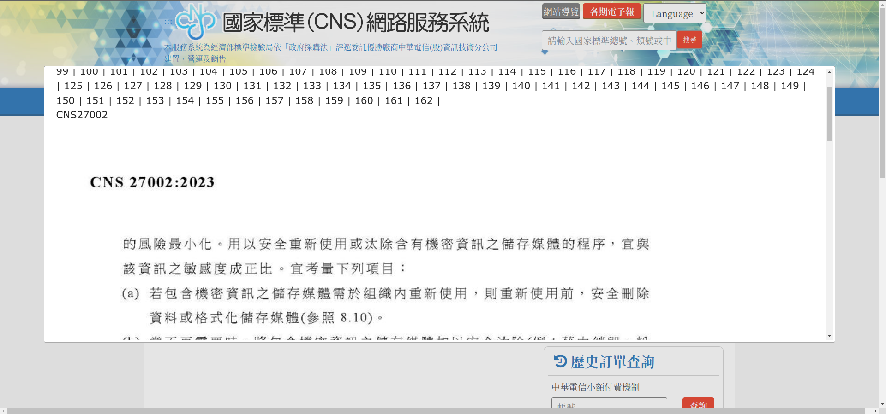

# CNSOnline Downloader
國家標準網路服務系統 (www.cnsonline.com.tw) 預覽版文件下載器

### 為什麼要做這個？
原版網站提供的預覽頁面故意做成很難瀏覽的形式：


此工具僅僅是協助收集所有頁面，將其轉換成 PDF 格式以便於閱讀。

因為是預覽版，所以每頁中間都會有浮水印。  
如要去除浮水印，請至原網站購買相關文件。

### 如何使用
0. 請先確保目前環境已安裝 [Node.js](https://nodejs.org/zh-tw)
1. 下載並解壓縮這個專案，在這個專案目錄下打開終端機
2. 安裝必要元件
```
npm i
```
3. 執行主程式
```
node index.js
```

### 使用範例
